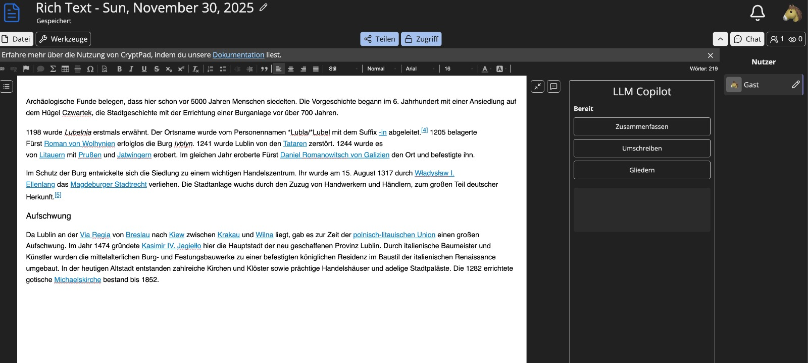
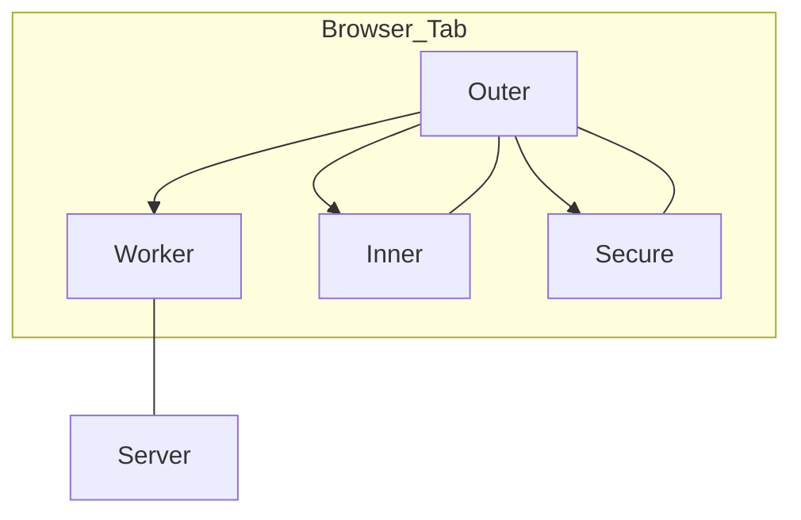
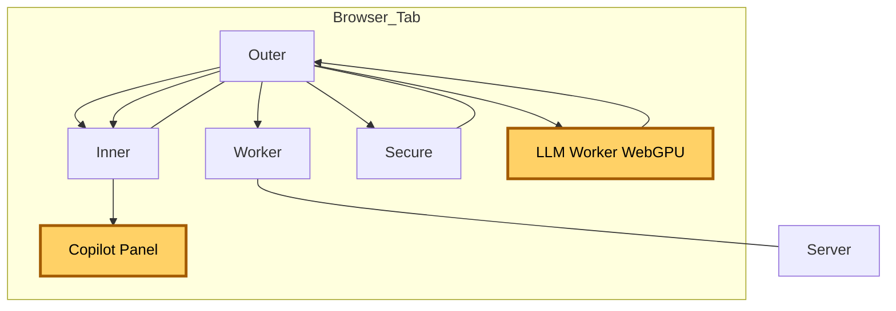
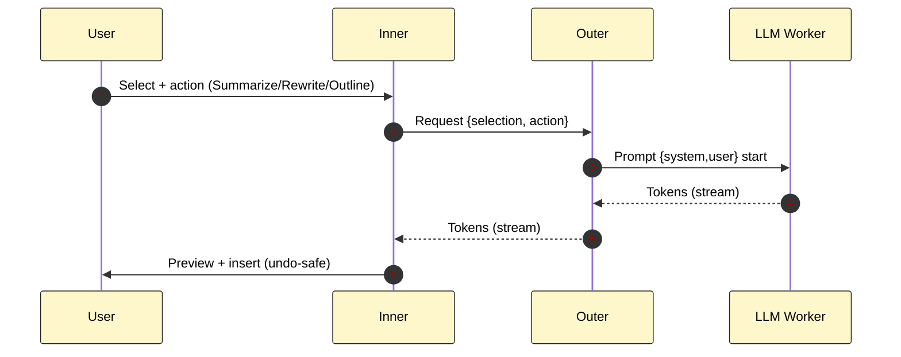

# CryptPad Copilot – local-only LLM based AI Assistance

## Summary 
We propose an optional, feature‑flagged Copilot for CryptPad “Documents” that runs fully on device (browser) via WebGPU. It adds three focused actions – Summarize, Rewrite (tone/style), Outline – without sending plaintext off the client. 

Key properties:
- Local inference only: Dedicated Web Worker (same origin), mini‑LLMs, model shards cached in OPFS.
- No telemetry, no network traffic (besides initial model files loading from same origin)
- Optional module behind a feature flag (default OFF), undo‑safe insert via editor hooks.

## User Value 
- Bring core “copilot” productivity to privacy‑sensitive users (NGOs, education, public sector) who cannot use cloud copilots.
- Inline actions where users work: select → stream preview → insert; no extra AI-provider account needed.
- Fast startup after first download; works offline for cached models.

## Current Client Architecture 

- Worker (SharedWorker): single WebSocket for all tabs on the origin; server sees ciphertext only.
- Outer: initializes Worker, brokers messages, performs decryption locally.
- Inner: full app UI (e.g., Documents); sandboxed, never sees keys.
- Secure iframe: sensitive UI (share/owners/passwords), isolated; mediated by Outer.

## Target Architecture with Copilot 

Design notes:
- Copilot Panel lives in Inner (Documents). LLM runs in a Dedicated Worker spawned by Outer; no SharedWorker usage for LLM (prevents cross‑tab spill).
- Models loaded from self and cached in OPFS.

## Local Data Flow 
